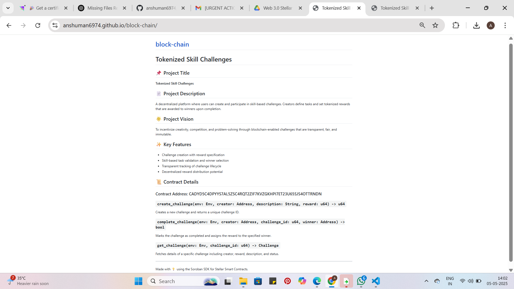

# Tokenized Skill Challenges

## 📌 Project Title
**Tokenized Skill Challenges**

## 📄 Project Description
A decentralized platform where users can create and participate in skill-based challenges. Creators define tasks and set tokenized rewards that are awarded to winners upon completion.

## 🖼 Demo Screenshot

## 🌟 Project Vision
To incentivize creativity, competition, and problem-solving through blockchain-enabled challenges that are transparent, fair, and immutable.

## ✨ Key Features
- Challenge creation with reward specification
- Skill-based task validation and winner selection
- Transparent tracking of challenge lifecycle
- Decentralized reward distribution potential

## 📜 Contract Details

### Contract Address: CADYD5C4DPYYS7AL5ZSC4RQT2ZIF7KVZGKHPI7ET23U65SJS4OTTRNDN

### `create_challenge(env: Env, creator: Address, description: String, reward: u64) -> u64`
Creates a new challenge and returns a unique challenge ID.

### `complete_challenge(env: Env, creator: Address, challenge_id: u64, winner: Address) -> bool`
Marks the challenge as completed and assigns the reward to the specified winner.

### `get_challenge(env: Env, challenge_id: u64) -> Challenge`
Fetches details of a specific challenge including creator, reward, description, and status.

---

Made with 💡 using the Soroban SDK for Stellar Smart Contracts.
